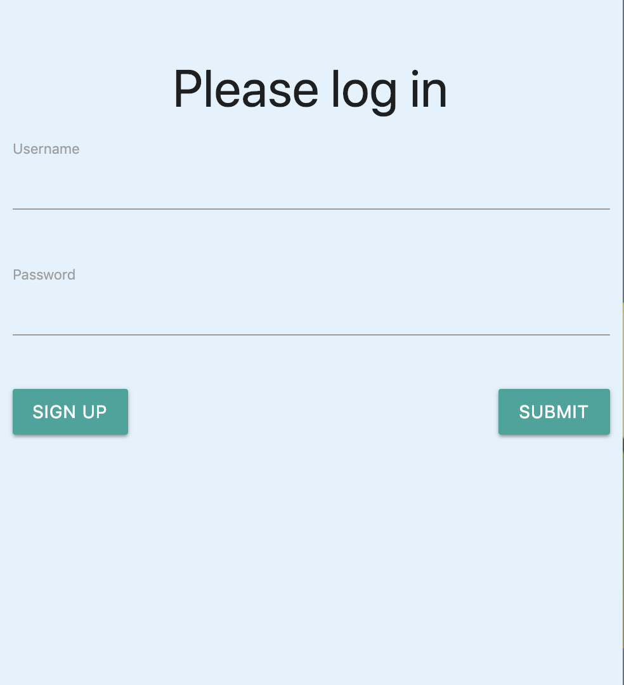
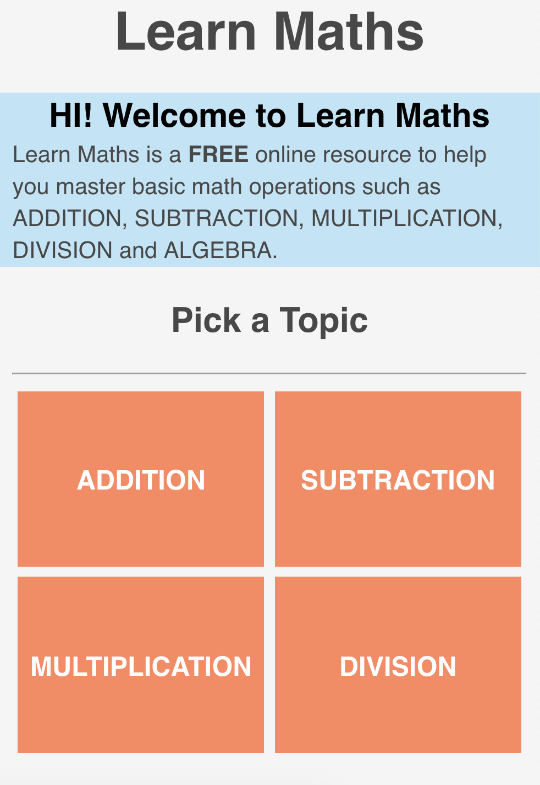
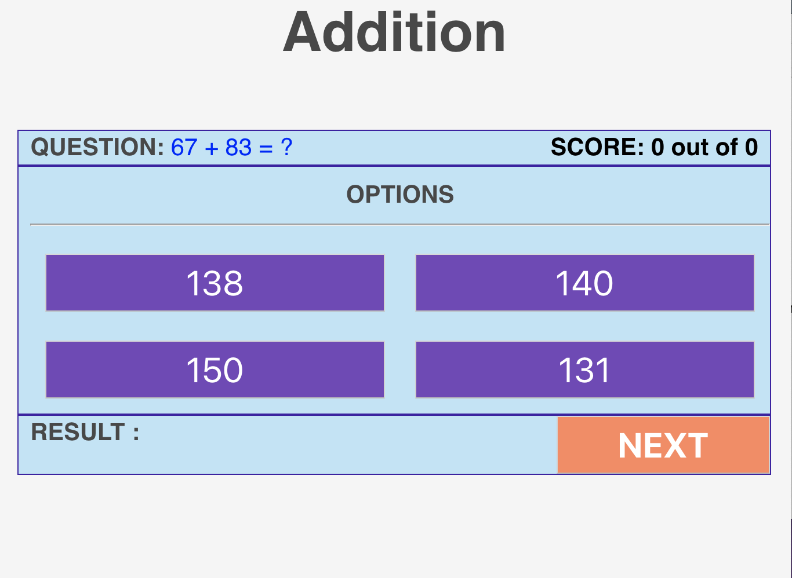
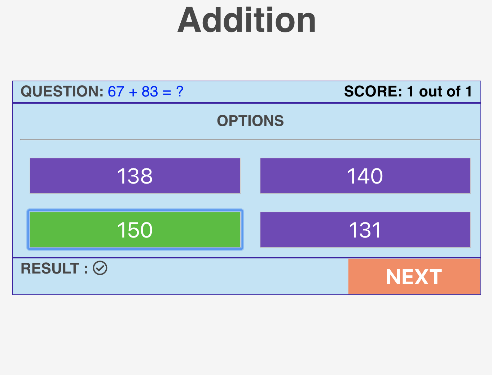
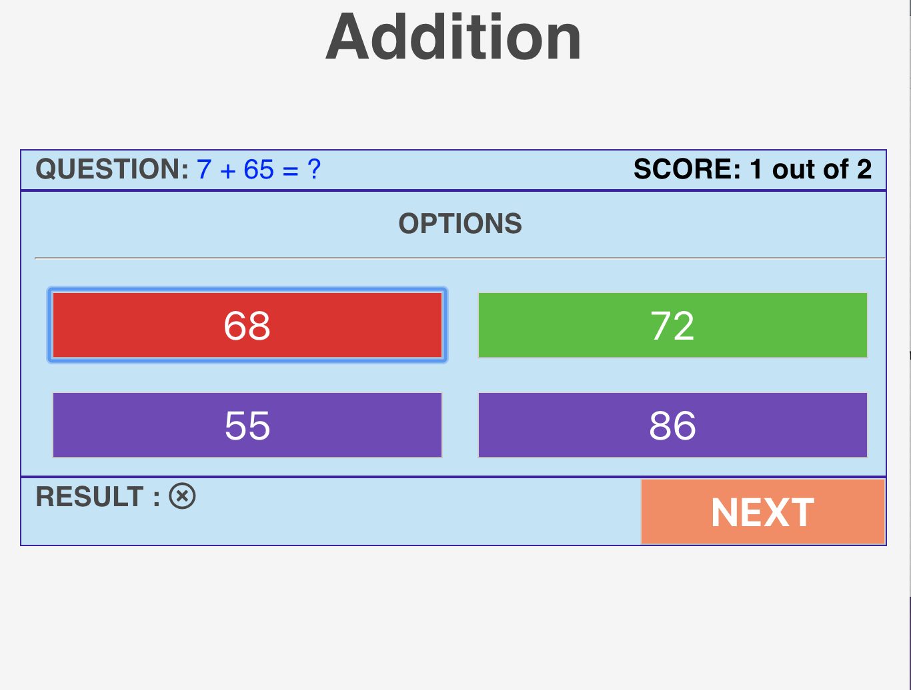

# Learn-Math
Website that auto generates math problems intended for 1 - 5th grades (Addition, Subtraction, Multiplication and Division)

## A Breif flow of the website is presented below

<a name="1">
<h3>Welcome Page</h3>

  
This is the Welcome Screen. If You already have a login, move to the <a href="#3">main page</a>. Else Proceed to <a href="#2">Signup Page</a>

  
<a name="2">
<h3>Signup Page</h3>

  
Now we can create a username and password and submit it in login page.<a href="#3">Main Page</a>

  
<a name="3">
<h3>Main Page</h3>

  
Now we can Proceed to either addition subtraction multiplication or devision.  All are basically same, so we go to <a href="#4">addition</a>

  
<a name="4">
<h3>Addition</h3>

  
This is addition Page. <a href="#5">Correct Answer</a> <a href="#6">Wrong Answer</a>

<a name="5">
<h3>Correct Answer</h3>

 
 
<a name="6">
<h3>Wrong Answer</h3>

